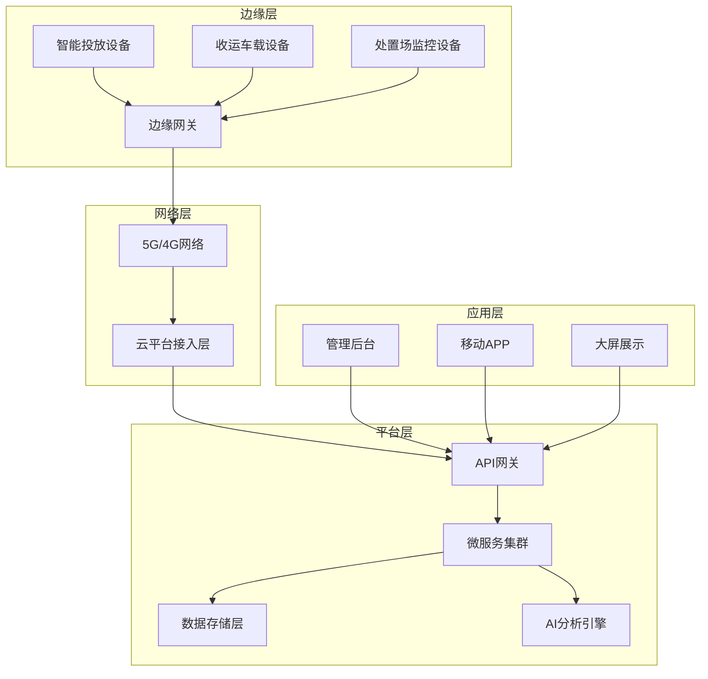
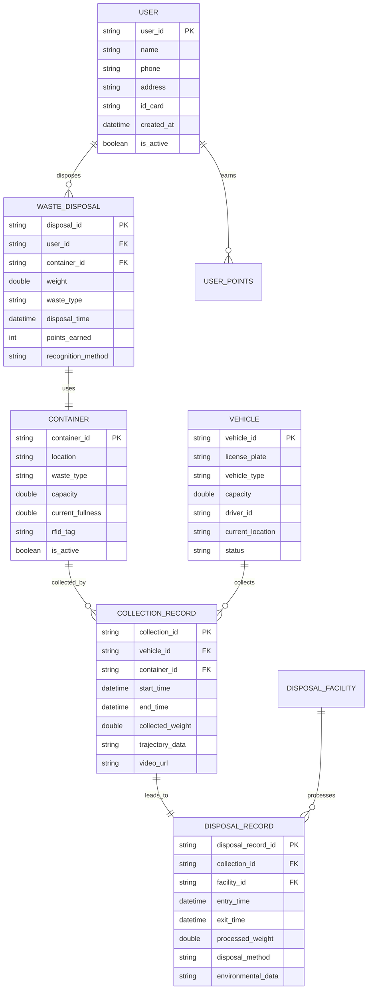
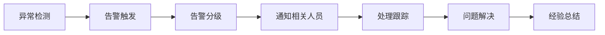

# 智慧环卫垃圾分类全链条智能监管系统设计文档

## 概述

本系统采用微服务架构，结合物联网、人工智能、大数据等技术，构建一个覆盖垃圾分类全链条的智能监管平台。系统通过云边协同的方式，实现数据的实时采集、处理、分析和决策支持。

## 系统架构

### 整体架构



### 技术栈选择

- **后端框架**: Spring Boot + Spring Cloud
- **数据库**: MySQL (关系型) + MongoDB (文档型) + Redis (缓存)
- **消息队列**: Apache Kafka
- **容器化**: Docker + Kubernetes
- **监控**: Prometheus + Grafana
- **AI框架**: TensorFlow + OpenCV
- **前端**: Vue.js + Element UI

## 核心组件与接口

### 1. 设备管理服务 (Device Management Service)

**职责**: 管理所有物联网设备的注册、配置、状态监控

**核心接口**:
```java
public interface DeviceService {
    DeviceInfo registerDevice(DeviceRegistrationRequest request);
    void updateDeviceStatus(String deviceId, DeviceStatus status);
    List<DeviceInfo> getDevicesByType(DeviceType type);
    DeviceConfig getDeviceConfig(String deviceId);
}
```

**关键功能**:
- 设备自动发现和注册
- 设备健康状态监控
- 远程配置下发
- 设备固件升级管理

### 2. 身份识别服务 (Identity Recognition Service)

**职责**: 处理人脸识别、二维码、IC卡等多种身份识别方式

**核心接口**:
```java
public interface IdentityService {
    IdentityResult recognizeFace(byte[] faceImage);
    IdentityResult scanQRCode(String qrCodeData);
    IdentityResult readICCard(String cardId);
    UserProfile getUserProfile(String userId);
}
```

**AI模型集成**:
- 人脸识别模型: 基于ResNet的深度学习模型
- 活体检测: 防止照片欺骗
- 识别准确率: >99%，响应时间: <3秒

### 3. 称重积分服务 (Weighing & Points Service)

**职责**: 处理垃圾称重、积分计算和用户激励

**核心接口**:
```java
public interface WeighingService {
    WeighingResult recordWeight(String deviceId, double weight, WasteType type);
    PointsResult calculatePoints(String userId, WeighingResult weighing);
    UserPoints getUserPoints(String userId);
    void redeemPoints(String userId, int points, String rewardId);
}
```

**积分算法**:
- 基础积分 = 重量(kg) × 类型系数 × 准确性系数
- 类型系数: 有害垃圾(5.0) > 可回收(3.0) > 厨余(2.0) > 其他(1.0)
- 准确性系数: 正确分类(1.0)，错误分类(0.5)

### 4. 收运监管服务 (Collection Monitoring Service)

**职责**: 监控垃圾收运全过程，包括RFID绑定、轨迹跟踪、视频记录

**核心接口**:
```java
public interface CollectionService {
    void bindContainerToVehicle(String containerId, String vehicleId);
    void reportContainerFullness(String containerId, double fullnessLevel);
    void startCollection(String vehicleId, List<String> containerIds);
    void recordTrajectory(String vehicleId, GPSPoint location, long timestamp);
    CollectionReport generateCollectionReport(String collectionId);
}
```

**实时监控能力**:
- GPS轨迹精度: ±3米
- 视频录制: 1080P，H.264编码
- 数据传输: 实时流式传输，断网自动缓存

### 5. 智能调度服务 (Smart Dispatch Service)

**职责**: 基于AI算法进行车辆和路线的智能匹配

**核心接口**:
```java
public interface DispatchService {
    DispatchPlan generateOptimalPlan(List<CollectionTask> tasks);
    RouteOptimization optimizeRoute(String vehicleId, List<String> containerIds);
    void validateNoMixedWaste(DispatchPlan plan);
    void updateDispatchStatus(String planId, DispatchStatus status);
}
```

**优化算法**:
- 路径优化: 改进的遗传算法 + 蚁群算法
- 约束条件: 车辆容量、时间窗口、垃圾类型匹配
- 优化目标: 最小化总行驶距离和时间

### 6. 处置监控服务 (Disposal Monitoring Service)

**职责**: 监控末端处置场所的运营情况和环保指标

**核心接口**:
```java
public interface DisposalService {
    void recordVehicleEntry(String vehicleId, String facilityId, double weight);
    void monitorEnvironmentalData(String facilityId, EnvironmentalData data);
    DisposalReport generateDisposalReport(String facilityId, Date date);
    void triggerEnvironmentalAlert(String facilityId, AlertType type);
}
```

**环保监控指标**:
- 大气排放: SO2, NOx, 颗粒物浓度
- 水质监测: pH值, COD, 重金属含量
- 噪声监测: 分贝值实时监控
- 预警阈值: 基于国家环保标准设定

### 7. 溯源执法服务 (Traceability & Enforcement Service)

**职责**: 提供垃圾溯源和执法支持功能

**核心接口**:
```java
public interface TraceabilityService {
    TraceResult traceWasteToSource(String wasteId);
    EvidencePackage collectEvidence(String violationId);
    EducationContent generateEducationContent(String userId);
    EnforcementReport generateEnforcementReport(String caseId);
}
```

**溯源链条**:
- 投放环节: 用户ID + 时间戳 + 地点 + 垃圾类型
- 收运环节: 车辆ID + 司机ID + 轨迹数据
- 处置环节: 处置场ID + 处置方式 + 最终去向

## 数据模型

### 核心实体模型



### 数据存储策略

**MySQL (关系型数据)**:
- 用户信息、设备信息、基础配置数据
- 事务性数据: 积分记录、收运记录

**MongoDB (文档型数据)**:
- 轨迹数据、视频元数据、日志数据
- 环保监测数据、AI分析结果

**Redis (缓存数据)**:
- 用户会话、设备状态、实时统计数据
- 热点数据缓存、分布式锁

**时序数据库 (InfluxDB)**:
- 传感器数据、GPS轨迹、环保指标
- 设备运行状态、系统性能指标

## 错误处理

### 错误分类与处理策略

**1. 设备故障处理**
- 网络断连: 本地缓存 + 重连机制
- 传感器异常: 多传感器冗余 + 异常检测
- 设备离线: 自动切换备用设备

**2. 数据异常处理**
- 数据丢失: 多副本存储 + 数据恢复
- 数据不一致: 分布式事务 + 最终一致性
- 数据篡改: 数字签名 + 区块链溯源

**3. 业务异常处理**
- 身份识别失败: 多种识别方式备选
- 称重异常: 重复称重 + 人工校验
- 调度冲突: 动态重新规划

**4. 系统异常处理**
- 服务不可用: 熔断器 + 降级策略
- 性能瓶颈: 自动扩容 + 负载均衡
- 安全威胁: 实时监控 + 自动防护

### 异常监控与告警



## 测试策略

### 测试层次

**1. 单元测试**
- 覆盖率要求: >80%
- 测试框架: JUnit 5 + Mockito
- 重点测试: 业务逻辑、算法实现

**2. 集成测试**
- API接口测试: Postman + Newman
- 数据库集成测试: TestContainers
- 消息队列测试: 嵌入式Kafka

**3. 系统测试**
- 端到端测试: Selenium WebDriver
- 性能测试: JMeter + Gatling
- 安全测试: OWASP ZAP

**4. 设备测试**
- 硬件兼容性测试
- 网络环境测试
- 极端条件测试

### 测试环境

**开发环境**: 本地Docker容器
**测试环境**: Kubernetes集群 + 模拟设备
**预生产环境**: 生产环境镜像 + 真实设备
**生产环境**: 灰度发布 + 监控告警

### 性能指标

- **响应时间**: API响应 <500ms, 设备响应 <3s
- **并发处理**: 支持10000+设备同时在线
- **数据处理**: 每秒处理1000+条消息
- **可用性**: 99.9%系统可用性
- **数据准确性**: 99.99%数据准确率

## 安全设计

### 数据安全
- 传输加密: TLS 1.3
- 存储加密: AES-256
- 访问控制: RBAC权限模型
- 数据脱敏: 敏感信息自动脱敏

### 设备安全
- 设备认证: 数字证书 + 硬件安全模块
- 通信安全: 端到端加密
- 固件安全: 数字签名验证
- 防篡改: 硬件安全芯片

### 应用安全
- 身份认证: OAuth 2.0 + JWT
- 接口安全: API签名验证
- 输入验证: 参数校验 + SQL注入防护
- 审计日志: 完整操作记录